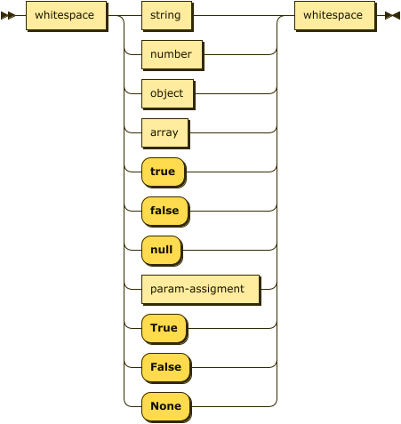
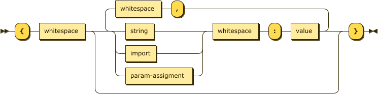

# jsonp - vscode extension

## Table of Contents

-   [Getting Started](#getting-started)
    -   [How to install](#how-to-install)
-   [Features](#features)
-   [Extension Settings](#extension-settings)
-   [Contribution](#contribution)
-   [Feedback](#feedback)
-   [About](#about)
    -   [Maintainers](#maintainers)
    -   [License](#license)

## Getting Started

This is a vscode extension supports enhanced JSON syntax (is called as `jsonp`)
which is used by [python-jsonpreprocessor](https://github.com/test-fullautomation/python-jsonpreprocessor) package.

### How to install
This extension is currently not available on 
[Visual Studio Marketplace](https://marketplace.visualstudio.com/vscode) or
[Open VSX Registry](https://open-vsx.org/), so you can install it manually as 
following steps:
- Get the latest extension `jsonp-x.x.x.vsix` file from this repo.
- Open [Visual Studio Code](https://code.visualstudio.com/) or 
[VSCodium](https://vscodium.com/), select **Extensions** Tab then cho 
**Install from VSIX**
- Browse to the downloaded `jsonp-x.x.x.vsix` file then install.

As soon as the installtion is completed, the files with `.jsonp` will be 
recognized properly.

## Features

Besides the [basic JSON syntax](https://www.json.org/), this extension helps
to recognize and highlight the `jsonp` which includes:

- `"[import]"` syntax:

   

- `param-assignment` syntax:

   

With new supported `jsonp` syntax, the JSON value and object syntax are
updated as below:

- `value`:

   

- `object`:

   

## Extension Settings

When installing this vscode extension successfully, all files with `.jsonp` 
extension will be automatically highlighted as `jsonp` systax.

In case you want files with `.json` are also recognized as `jsonp` syntax, the
below setting is required in vscode `settings.json` files:
```
"files.associations": {
   "*.json": "jsonp"
},
```

## Contribution

We are always searching support and you are cordially invited to help to
improve [jsonp](https://github.com/test-fullautomation/jsonp) vscode extension.

## Feedback

Please feel free to give any feedback to us via

Email to: [Robot Framework Support Group](mailto:RobotFrameworkSupportGroup@bcn.bosch.com)

Issue tracking: [vscode-jsonp Issues](https://github.com/test-fullautomation/vscode-jsonp/issues)

## About

### Maintainers

[Thomas Pollerspöck](mailto:Thomas.Pollerspoeck@de.bosch.com)

[Tran Duy Ngoan](mailto:Ngoan.TranDuy@vn.bosch.com)

### License

Copyright 2020-2022 Robert Bosch GmbH

Licensed under the Apache License, Version 2.0 (the \"License\"); you
may not use this file except in compliance with the License. You may
obtain a copy of the License at

> [](http://www.apache.org/licenses/LICENSE-2.0.html)

Unless required by applicable law or agreed to in writing, software
distributed under the License is distributed on an \"AS IS\" BASIS,
WITHOUT WARRANTIES OR CONDITIONS OF ANY KIND, either express or implied.
See the License for the specific language governing permissions and
limitations under the License.
